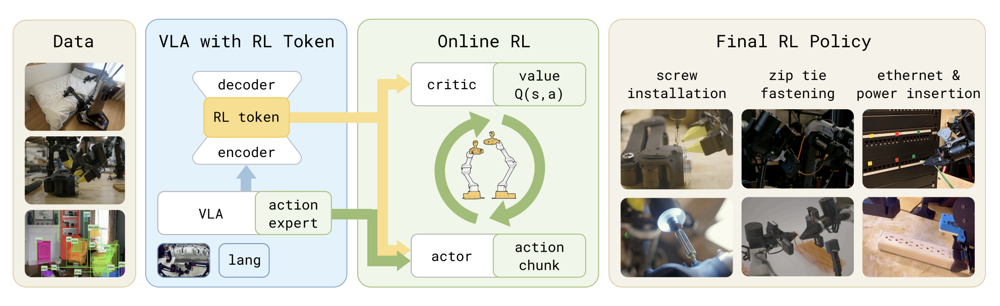

# RLT-OpenPI

An implementation of **RL Token: Bootstrapping Online RL with Vision-Language-Action Models** (Xu et al., Physical Intelligence) built on top of [OpenPI](https://github.com/Physical-Intelligence/openpi)'s public checkpoints.

Paper: https://pi.website/research/rlt



> **Note on the example environment.** The end-to-end commands, scripts under `example/`, and the hardware sections below use an **ALOHA dual-arm** setup as the primary example. RLT itself is environment-agnostic: the env, intervention manager, data transforms, and VLA checkpoint are all pluggable. If you are running against a different robot, simulator, dataset, or VLA configuration, substitute your own `--env-factory`, `--intervention-factory`, `--data-transforms-fn`, and `--vla-config-name` accordingly.

---

## Repository Layout

```
src/rlt_openpi/
  models/          RLTokenEncoder/Decoder, Actor (residual), TwinQCritic
  training/        Stage 1 + Stage 2 trainers, configs, replay buffer, TD3 utils
  vla/             OpenPI VLA wrapper, embedding extractor hooks
  rollout/         RolloutWorker, base env/intervention/reward interfaces, factory
  envs/aloha/      Example ALOHA env factory
  policies/aloha/  Example ALOHA data transforms
  utils/           Checkpoint I/O, wandb logger, rich terminal UI
scripts/
  train_rl_token.py    Stage 1 entry point
  train_online_rl.py   Stage 2 entry point
  inference.py         Unified Stage 1 / Stage 2 inference (rollout)
exp/
  stage1.sh, stage2.sh, infer.sh           Example run commands
tests/               Unit tests for models, buffers, and training loop
```

---

## Installation

```bash
git clone https://github.com/yknxh/rlt-openpi.git
cd rlt-openpi
bash setup_env.sh        # creates a conda env named 'rlt'
conda activate rlt
```

The script creates a conda env with Python 3.11, installs OpenPI + rlt-openpi via `uv` (needed for OpenPI's deep dependency graph), and patches `transformers` with OpenPI's `transformers_replace` files.

You can pass a custom env name: `bash setup_env.sh myenvname`.

### Installation on Robot Machine

On a robot host running Stage 2 with [DROID](https://github.com/droid-dataset/droid), add `--robot` and set `DROID_DIR` to your local DROID clone to also install the DROID teleop stack, Oculus reader, ZED camera bindings, and opencv/protobuf fixups:

```bash
DROID_DIR=/path/to/droid bash setup_env.sh --robot
conda activate rlt
```

Requires the ZED SDK at `/usr/local/zed` for pyzed bindings (skipped gracefully if not found).

---

## Checkpoints

Download an OpenPI checkpoint from the [OpenPI model zoo](https://github.com/Physical-Intelligence/openpi#checkpoints) (hosted on GCS at `gs://openpi-assets/checkpoints/`). The downloaded JAX/Orbax checkpoint needs to be converted to PyTorch:

```bash
python scripts/tools/convert_jax_to_pytorch.py \
    --checkpoint-dir ~/.cache/openpi/openpi-assets/checkpoints/pi05_droid \
    --config-name pi05_droid_finetune \
    --output-path checkpoints/pi05_droid_pytorch
```

This produces a `model.safetensors` file. Point `--train.vla-checkpoint-dir` / `--vla-checkpoint-dir` at it. Any OpenPI checkpoint compatible with your chosen `--vla-config-name` will work.

---

## Data

Stage 1 training reads demonstrations in [LeRobot](https://github.com/huggingface/lerobot) format. The dataset is located by `repo_id` — LeRobot resolves it to `$HF_LEROBOT_HOME/<repo_id>/` on disk (default `~/.cache/huggingface/lerobot/<repo_id>/`).

To use a **local dataset**, set the environment variable before launching training:

```bash
export HF_LEROBOT_HOME="/path/to/your/data"
```

For example, if your dataset lives at `/data/my_task_lerobot/`, set `HF_LEROBOT_HOME=/data` and pass `--repo-id my_task_lerobot`.

For details on converting raw demonstrations to LeRobot format and computing normalization statistics, refer to the [OpenPI data preparation scripts](https://github.com/Physical-Intelligence/openpi/tree/main/scripts/data_prep) (`convert_to_lerobot.py` and `compute_norm_stats.py`).

---

## Stage 1: Train the RL Token

Trains a small encoder/decoder to compress the VLA's internal per-token embeddings `z_{1:M}` into a single **RL token** `z_rl`, via masked MSE reconstruction on a LeRobot demonstration dataset. With `--train.vla-finetune-alpha 0` the VLA is frozen; with `α > 0` the VLA is co-finetuned using a weighted flow-matching loss (matching the paper's `L_ro + α · L_vla` objective).

Example command (see `exp/stage1.sh`):

```bash
CHECKPOINT_DIR="$HOME/.cache/openpi/openpi-assets/checkpoints/pi05_droid_pytorch/model.safetensors"

python scripts/train_rl_token.py \
    --train.vla-config-name pi05_droid_finetune \
    --train.vla-checkpoint-dir "$CHECKPOINT_DIR" \
    --train.vla-finetune-alpha 1.0 \
    --train.batch-size 32 \
    --train.num-train-steps 5000 \
    --repo-id local/stack_the_blocks_100 \
    --data-transforms-fn rlt_openpi.policies.aloha.config.aloha_data_transforms
```

Swap `--repo-id`, `--data-transforms-fn`, and the VLA config/checkpoint for your own dataset and robot.

Key flags (full list in `src/rlt_openpi/training/config.py::RLTokenTrainConfig`):

| Flag | Purpose |
| --- | --- |
| `--train.vla-finetune-alpha` | `0.0` = frozen VLA (only encoder/decoder trained); `> 0` = joint finetune. |
| `--train.num-train-steps` | Default `5000`. |
| `--train.batch-size` | Default `32`. |
| `--train.warmup-steps` | Linear LR warmup, default `500`. |
| `--train.resume-checkpoint` | Resume from a previous `rl_token_step<N>.pt`. |
| `--train.save-every` | Checkpoint interval (default `1000`). |
| `--repo-id` | LeRobot dataset ID. |
| `--data-transforms-fn` | Import path to a data-transform factory (e.g. `rlt_openpi.policies.aloha.config.aloha_data_transforms`). |

Outputs land under `checkpoints/stage1_rlt_encoder/<run_name>/rl_token_step<N>.pt`, where `run_name` defaults to `run_YYYYMMDD_HHMMSS`.

---

## Stage 2: Online RL

With VLA + encoder frozen, a lightweight **Actor** and **Twin-Q Critic** are trained online. The actor conditions on `(z_rl, VLA reference action chunk)` and outputs a **residual** over the VLA's proposal (zero-initialized last layer, so the actor starts as a copy of the VLA). The loop first runs a **warmup phase** collecting episodes with the base VLA policy, then alternates between rollout collection and off-policy TD3-style updates at UTD = 5, with a BC regularizer pulling the actor toward the VLA reference and reference-action dropout. A human supervisor provides sparse success/failure/progress rewards and can take over the robot via a VR controller mid-episode; interventions are stored in the replay buffer as corrective labels.

### Example hardware (ALOHA)

The example `--env-factory` targets:

- ALOHA dual-arm robot.
- Multiple cameras matching the layout expected by `aloha_data_transforms`.

To run against a different robot or simulator, implement your own `make_env` / `make_intervention` callables and pass their import paths via `--env-factory` and `--intervention-factory`.

### Example command (see `example/stage2_unified.sh`)

```bash
python scripts/train_online_rl.py \
    --env-factory rlt_openpi.envs.aloha.env_factory.make_aloha_env \
    --vla-config-name pi05_droid_finetune \
    --vla-checkpoint-dir checkpoints/pi05_droid_pytorch/model.safetensors \
    --rl-token-checkpoint checkpoints/stage1_rlt_encoder/rl_token_step3000.pt \
    --task-prompt "pick up the cup" \
    --warmup-steps 250 \
    --chunk-length 10 \
    --max-episode-chunks 150 \
    --save-dir checkpoints/stage2_ac_online
```

Key flags (full list in `src/rlt_openpi/training/config.py::OnlineRLTrainConfig`):

| Flag | Purpose |
| --- | --- |
| `--env-factory` | Import path to a `make_env` callable. |
| `--intervention-factory` | Import path to a `make_intervention` callable. Optional. |
| `--rl-token-checkpoint` | Stage 1 checkpoint (encoder + optional finetuned VLA). |
| `--task-prompt` | Language instruction passed to the VLA each step. |
| `--warmup-steps` | Number of env steps of pure base-VLA data collection before RL updates start. |
| `--chunk-length` | Action chunk length `C`. |
| `--max-episode-chunks` | Safety cap per episode. |
| `--warmup-buffer` | Load a previously saved warmup buffer and skip the warmup phase. |
| `--resume-checkpoint` | Resume a Stage 2 run. |

Defaults worth knowing: `gamma=0.99`, `tau=0.005`, `utd_ratio=5`, `bc_regularizer_beta=0.5`, `actor_noise_sigma=0.1`, `ref_action_dropout=0.5`, `batch_size=256`.

---

## Human-in-the-Loop Controls (Stage 2)

**Keyboard rewards** — non-blocking listener in `src/rlt_openpi/rollout/reward.py` reads single keypresses (no Enter needed):

| Key | Meaning |
| --- | --- |
| `s` or `Space` | Success — reward `+1.0`, episode ends. |
| `f` | Failure — reward `0.0`, episode ends. |
| `p` | Progress — reward `+0.5`, episode continues. |

Success/failure are latched; progress is consumed on read. Headless runs (no TTY) degrade gracefully to line-buffered input.

**VR intervention** — When the operator engages the VR controller, the intervention manager takes over the current action chunk; the executed human action is written to the replay buffer and downstream BC regularization pulls the actor toward it. On a different rig, provide your own `InterventionManager` subclass.

**Terminal UI** — `src/rlt_openpi/utils/display.py` renders warmup progress, per-episode stats, and operator instructions using [`rich`](https://github.com/Textualize/rich).

---

## Inference

`scripts/inference.py` auto-detects whether a checkpoint is a Stage 1 (VLA-only) or Stage 2 (VLA + RL token + actor) artifact and runs the appropriate rollout loop on whatever env factory you pass in. Example command:

```bash
# example/infer/infer.sh
python scripts/inference.py \
    --env-factory rlt_openpi.envs.aloha.env_factory.make_aloha_env \
    --vla-config-name pi05_droid_finetune \
    --vla-checkpoint-dir checkpoints/pi05_droid_pytorch/model.safetensors \
    --rl-token-checkpoint checkpoints/stage1_rlt_encoder/rl_token_step5000.pt \
    --checkpoint checkpoints/stage2_ac_online/run_latest/online_rl_ep100.pt \
    --task-prompt "stack the three blocks on the tray" \
    --num-episodes 50
```

Results (per-episode success, reward, length) are written to JSON under the run's save dir.

---

## Tests

```bash
pytest tests/
```

Covers: RL token encoder/decoder shapes, VLA embedding extraction hooks, Actor + TwinQCritic forward/backward, replay buffer, and an end-to-end Stage 2 trainer smoke test.

---

## Status & Limitations

This is an **implementation** — unofficial and not affiliated with Physical Intelligence. It is under active development and may still contain bugs.

Currently implemented:

- Stage 1 RL token training with both frozen-VLA and joint VLA-finetune modes.
- Stage 2 TD3-style online RL (twin Q, delayed actor, Polyak targets, BC regularizer, reference-action dropout, subsampled chunk stride).
- Example ALOHA dual-arm env wrapper with multiple cameras.
- Example keyboard-based human intervention (corrective actions written to the buffer).
- Keyboard-based human reward shaping.
- Rich terminal UI for warmup + rollout progress.
- Evaluation script that auto-detects Stage 1 vs Stage 2 checkpoints.

Not yet validated end-to-end on the four paper tasks (screw installation, zip-tie fastening, Ethernet insertion, charger insertion). The ALOHA dual-arm path is the primary development target; other robots, simulators, and VLA configs are supported in principle but untested here.

---

## Citation

```
@article{xu2025rltoken,
  title   = {RL Token: Bootstrapping Online RL with Vision-Language-Action Models},
  author  = {Xu, Charles and Springenberg, Jost Tobias and Equi, Michael and Amin, Ali
             and Esmail, Adnan and Levine, Sergey and Ke, Liyiming},
  year    = {2025},
  journal = {Physical Intelligence},
  url     = {https://pi.website/research/rlt}
}
```

The VLA backbone and training infrastructure come from [OpenPI](https://github.com/Physical-Intelligence/openpi). All credit for the RLT method belongs to the paper's authors; any errors in this reimplementation are mine.
